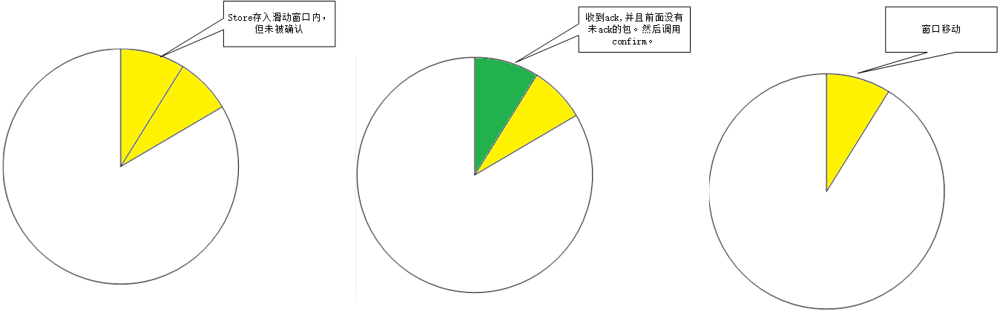

# upp : udp based protocol with probability

It's not a complete protocol,but it's good enough to work.
I cut some features unnecessary and hard work is needed to optimize this protocol.

这并不是一个完整的通讯协议，但是可以正常工作。还缺少握手过程、心跳等。
这个协议最大的特点就是可以轻易地更换具体实现过程。当然实际上，抽象做的还不够好。目前来说够用就好。
slide window 这个模块的抽象我还是比较满意的。
## Architecture
I divide upp into three part.
 1. transfer layer
 2. protocol layer
 3. abstract layer

### transfer layer
This layer send binary data to remote,and receive binary data.
Another mission in this layer is control send rate.
这里主要完成数据交换。**udp_transfer,upp_transfer_test**是2个不同的实现，在udt模块中将名字换一下就可以了。
控制发送速率的功能也放在这里， 通过拥塞窗口来控制速率并不准确。
### protocol layer
This layer implement the detail of our protocol.I reference to udt protocol,but not equal to udt.
**udt.erl,protocol.hrl,protocol.erl**：是协议的具体内容
**sender.erl,receiver.erl**:实现抽象层的回调函数，辅助协议的具体实现
### abstract layer
I implement slide window in this layer.
It's necessary to every protocol,so I define some behaviors to reduce work in protocol layer.
实现了一个抽象的滑动窗口。

| 接口功能 | sender中的功能 | receiver中的功能 |
----------|----------------|------------------
| store    | 发送数据       | 接受数据         |
| ack      | 发送ack包      | 收到ack包        |

## feature
Simplex channel: data from sender to receiver.
Easy to replace transfer layer or protocol layer.
